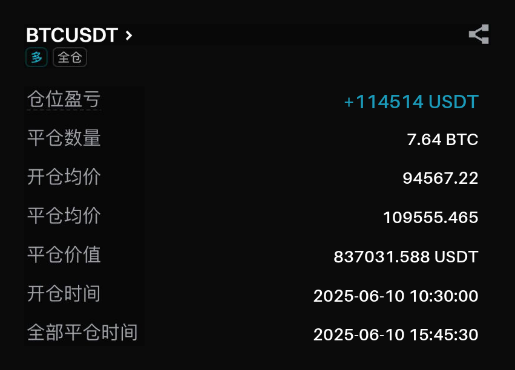
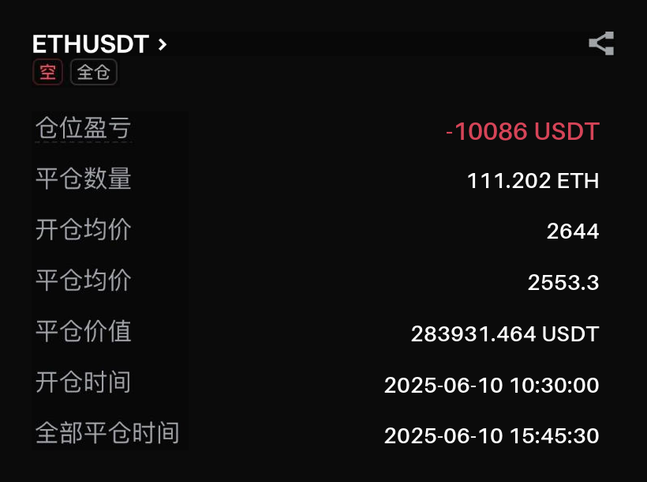
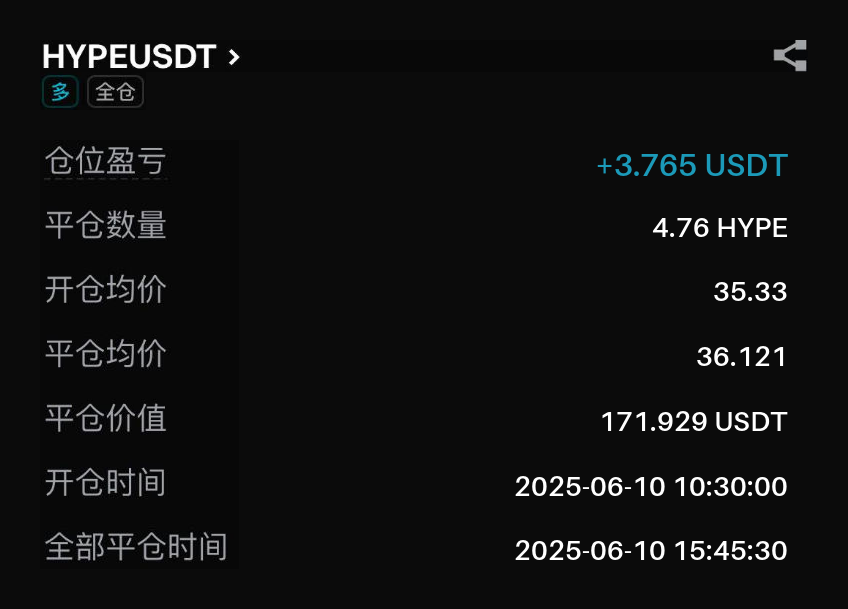

# Trading Record Generator

Generate trading record images with custom token pair and data.

## Quick Start

```bash
python trading_record_generator.py -d <direction> -t <token> -p <pnl> -o <open_price> -c <close_price> -ot <open_time> -ct <close_time>
```

## Command Cheat Sheet

### Long BTC (Profitable)
```bash
python trading_record_generator.py -d long -t btc -p 3.736 -o 35.096 -c 35.816 -ot 20250608222135 -ct 20250609012745
```

### Short ETH (Loss)
```bash
python trading_record_generator.py -d short -t eth -p -1.234 -o 36.500 -c 35.006 -ot 20250610103000 -ct 20250610154530
```

### Long HYPE (Small Profit)
```bash
python trading_record_generator.py -d long -t hype -p 0.582 -o 34.356 -c 33.908 -ot 20250707011207 -ct 20250707012331
```

## Parameters

| Parameter | Description | Example |
|-----------|-------------|---------|
| `-d` | Direction (long/short) | `long` |
| `-t` | Token (btc/eth/hype) | `btc` |
| `-p` | PnL (can be negative) | `3.736` |
| `-o` | Open price | `35.096` |
| `-c` | Close price | `35.816` |
| `-ot` | Open time (YYYYMMDDHHMMSS) | `20250608222135` |
| `-ct` | Close time (YYYYMMDDHHMMSS) | `20250609012745` |

## Auto-Calculated Fields

- **Quantity**: `|PnL| / |close_price - open_price|`
- **Close Value**: `quantity × close_price`
- **Unit**: Matches token (BTC/ETH/HYPE)

## Demo Results

See example outputs in `./asset/`:

### Long BTC Trade 


### Short ETH Trade 


### Long HYPE Trade 


## Output

Images saved to `./output/` with format:
`trading_record_{direction}_{token}_{timestamp}.png` 